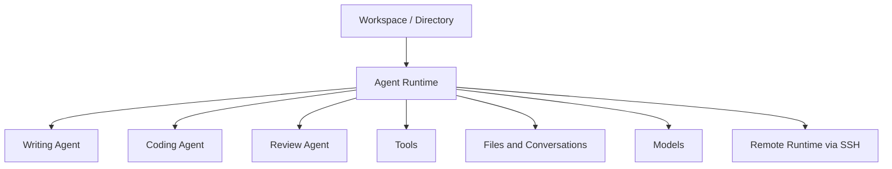

Traditional operating systems answer questions such as: How does an application start? Where are files stored? How are processes isolated? How does networking work? What happens when something fails?

In the age of agents, we need to answer a different set of questions:

- How does an agent start?
- Where does an agent run?
- What capabilities does an agent have?
- How do agents collaborate with one another?
- If one agent crashes, will it bring down the main application?
- Is the agent running locally or on a remote machine?
- How do we manage token usage, processes, and port usage across different machines and agents?

Once you put these questions together, an agent is no longer just a chat box. It starts to look like a new runtime layer. I call this layer **AgentOS**.

## AgentOS Is Not a Chat Box. It Is a Runtime Layer for Agents

If you are building only one agent, many things can be hard-coded into the application: how it starts, which tools it can use, where the context lives, which model it calls, and even how errors are handled.

But once a user has multiple directories, multiple agents, multiple models, and multiple remote environments, the problem becomes much more complex.

For example:

- A writing directory should be bound to a writing agent;
- A code repository should be bound to a coding agent;
- A research folder may need a researcher agent;
- A subdirectory may have its own rules and its own agent;
- Some tasks should run locally, while others should run on a remote server;
- If one agent crashes, it should not crash the entire host application.

At that point, what we need is not a bigger chat box. We need a system layer that manages these relationships.

That is what AgentOS does. It organizes directories, agents, models, tools, runtimes, process boundaries, and remote environments into one coherent operating layer.

## How a Task Happens in OpAgent

In OpAgent, a task roughly works like this:

1. You open a directory, such as `docs/`;
2. OpAgent treats that directory as a workspace;
3. You bind a writing agent to that workspace;
4. The agent reads the materials in the directory and discusses them with you in Markdown;
5. The conversation is saved as files, and the agent's output is written back into the directory;
6. If needed, it can call another proofreading agent or invoke a tool;
7. If the directory is on a remote machine, OpAgent can start a remote runtime through SSH and let the agent work inside the remote directory.

On the surface, this may still feel like chatting with AI. But underneath, it already involves operating-system-like concerns: workspace management, permissions, state, processes, tools, remote execution, file persistence, and failure isolation.

That is why I see OpAgent as an AgentOS, not just an AI editor.

## Why Not LangChain, LangGraph, or Claude SDK?

I started studying MCP in April 2025. At the time, I was also building a plugin system in Golang, which led me to a simple question: if MCP can call tools, why can't it call agents?

In other words, can we install agents into a runtime the way we install plugins?

LangChain and LangGraph are better suited for orchestrating an agent workflow inside code. A developer writes the model calls, tools, and state graph into one program, and that program exposes capabilities to the outside world.

But OpAgent is not trying to be a framework for writing agent applications. It is trying to be an environment for running agents.

In this environment:

- An agent can be developed independently by a different team;
- An agent can run as an independent process, so a crash does not take down the host application;
- An agent can be implemented in Go, Python, Node, or another language;
- An agent can be installed, upgraded, and replaced;
- An agent can run locally or remotely;
- A directory can have its own agent, and a subdirectory can have its own agent too.

So OpAgent cares more about runtimes, communication protocols, process boundaries, directory binding, and file persistence than about putting all agent logic into one application process.

## Frameworks Solve Orchestration. AgentOS Solves Runtime.

One way to put it is:

- LangChain and LangGraph focus on **orchestrating agent workflows inside a program**;
- Claude SDK focuses on **calling models and capabilities from an application**;
- AgentOS focuses on **installing, starting, running, coordinating, isolating, and persisting agents**.

These categories do not have to be mutually exclusive. An agent can still use LangGraph internally. A specific feature can still be implemented with Claude SDK. But from the perspective of OpAgent, those are components inside the runtime environment.

AgentOS is concerned with a lower-level question: when there are more agents, more complex tasks, and more distributed workspaces, who manages the agents? Who saves their context? Who isolates their failures? Who connects local and remote execution?

## OpAgent's Goal: Make Agents Runnable and Manageable Units

My understanding of AgentOS is simple: an agent should not be merely a prompt, nor should it be just a feature button inside an application. It should become a unit that can be run, installed, replaced, upgraded, and coordinated with other units.

Once agents are treated as runtime units, many design choices change:

- A directory is not just a folder; it is an agent workspace;
- A conversation is not just temporary context; it is a persistent process record;
- A tool is not just a function call; it is a capability boundary;
- A remote machine is not just a deployment target; it is part of the agent runtime;
- Multiple agents are not just multiple chat windows; they are cooperating processes and roles.

That is what I mean by AgentOS.

It is not meant to replace traditional operating systems. Instead, it adds an agent-oriented runtime layer on top of them.

In that sense, OpAgent is not trying to build yet another agent framework. It is exploring a real AgentOS: a system where agents can run reliably across local machines, remote machines, different directories, different processes, and different tools.