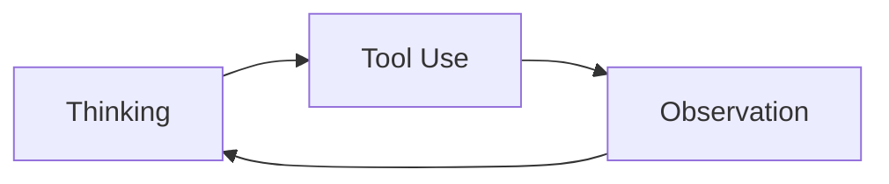

看了 Karpathy 的 LLM Wiki 之后，我准备重新捡起自己的博客，并把它和 LLM Wiki 式的知识库放到一起。

过去一年多，我一直在深入研究 AI 工程落地。相比只把零散想法写在不同软件里，我现在更想要一种稳定的工作流：原始想法先沉淀在 `raw/` 目录，知识库负责长期维护，博客系统负责对外发布。AI 则根据明确的 SOP 自动完成转换和发布。

## 过去一年，我如何理解 AI 工程

我大概是从去年 4 月开始接触 AI 落地的。

当时最流行的是 Dify、n8n，网上到处都是搭建 n8n 工作流、Dify AI 知识库之类的内容。我也是从 n8n 开始了解 AI 的。那时 MCP 很火，看起来也很神秘，我很想搞清楚它到底能做什么。

### 第一次实践：用自然语言查询安全告警

我的第一次实践，是用 n8n 接入 MCP，实现自然语言查询安全告警信息。

大致流程是：

1. 用 MCP 接入 Wazuh 的 indexer；
2. 自然语言入口放在飞书机器人里；
3. 用户和飞书机器人对话；
4. 消息转发到 n8n；
5. n8n 调用 MCP 完成查询；
6. 最后把 Wazuh 的查询结果通过飞书机器人返回给用户。

这个项目让我初步了解了 AI 的用法，以及 AI 系统背后大致的工作原理。

### 第二次实践：企业级 AI 安全测试系统

第二次实践，是做一个企业级 AI 安全测试系统。

这个项目让我彻底理解了 Dify、n8n 这类平台在复杂场景下的限制，也让我看清了很多主流 AI Agent 框架的问题，例如 LangChain、LangGraph、Eino 等。

这些框架当然有价值，但在真实项目里，层层封装会带来很高的理解成本和调试成本。回到第一性原理，一个最简单的 AI Agent，本质上只需要能够循环调用工具：

也就是说，核心并不神秘，无非是 `Thinking -> Tool Use -> Observation` 的循环。

与其花大量时间去理解复杂框架，不如从头实现一版真正符合项目需要的系统。于是我从 0 到 1 写了一套企业级 AI Agent 通用框架，并在实际客户环境中完成落地。

当然，这个过程也走了很多弯路。那时候 AI 编程还没有现在这么强，后端基本全靠手写，AI 主要只能辅助写一些前端。我对 AI 系统的理解也还不够深入，所以项目中重写了很多遍。

### 第三次实践：多 Agent 交易平台

第三次实践，是基于自己的 AI Agent 框架构建多 Agent 交易平台。

这次项目最终拿到了最佳收益奖。对我来说，它进一步证明了一件事：Agent 系统真正困难的部分，不只是“能不能调用工具”，而是如何把目标、工具、状态、反馈和评估组织成一个可持续迭代的系统。

### 第四次实践：OpAgent

第四次实践，就是我现在正在使用的 OpAgent。

我不想在 Claude Code、Codex 和 Markdown 软件之间不断切换，所以想做一款类似 Cursor，但更侧重 Markdown、多工作空间和知识库协作的一体化软件。

对我来说，OpAgent 不只是一个编辑器，它也是我整理 AI 工程经验、写作、研究和发布内容的工作台。

## Karpathy 的 LLM Wiki 给我的启发

最近看了 Karpathy 的知识库结构，我发现里面很多设计思路，其实和我开发 OpAgent 时的方向非常接近，只是我之前没有这么系统地表达出来。

其中对我启发最大的，是 `raw/` 目录。

我的理解是：

- `raw/` 保存最原始的输入，不急着整理，不急着美化；
- `wiki/` 保存长期维护的知识；
- `index.md` 负责导航和关键流程入口；
- AI 根据 SOP 读取上下文，然后执行明确任务。

这套结构的价值在于：它既保留了原始材料，又不会让不同工作流互相污染。

## 我的博客发布结构

我准备把原始文章都写到 `raw/` 目录里，然后在 `index.md` 中维护发布流程索引。AI 每次接到发布任务时，会先读索引，再读取对应 SOP，最后把原文转换成适合博客发布的文章。

这样设计后，发布博客就可以变成一句话：

> 发布这篇文章到 cblog。

AI 收到这句话后，会自动完成：

1. 读取原始文章；
2. 检查是否有不适合公开的信息；
3. 转换成博客格式；
4. 复制必要图片；
5. 写入 cblog 项目；
6. 构建验证；
7. 提交并推送。

后续如果要扩展到微信公众号、X、小红书，也只需要继续补充对应平台的 SOP。

## 用 Cloudflare 免费托管博客

这里也简单记录一下，我是怎么部署这个博客的。

### 1. 创建 GitHub 仓库

如果要部署到 Cloudflare 上，Astro 框架会比较方便，因为它和 Cloudflare 的集成很好。

我当前使用的博客项目是：[ColinAgent/cblog](https://github.com/ColinAgent/cblog)。

### 2. 准备域名

如果还没有域名，可以先购买一个域名。Cloudflare 本身也可以直接购买和管理域名。

### 3. 创建 Cloudflare Worker

然后创建 Cloudflare Worker，把项目托管到 Cloudflare 上。这样就不需要单独购买服务器。

理想情况下，可以在 Cloudflare 里连接 GitHub 仓库。之后每次推送代码，Cloudflare 都会自动部署博客。

## 结语

我现在越来越相信，AI 原生的知识管理不是简单地把聊天窗口、Markdown 和文件夹拼在一起，而是要有一套清晰的结构：

- 原始材料在哪里；
- 长期知识在哪里；
- 发布流程在哪里；
- AI 应该按什么规则行动。

Karpathy 的 LLM Wiki 给了我一个很好的参照。接下来，我会继续把过去一年多做 AI 工程落地的经验写出来，并通过这套 `raw -> wiki -> cblog` 的流程持续发布。