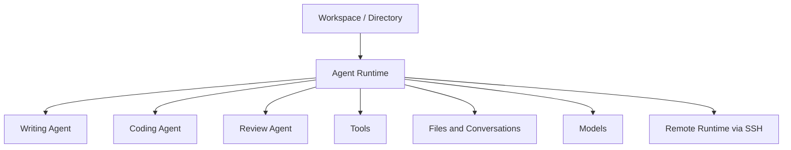

传统操作系统回答的问题是：应用怎么启动？文件放在哪里？进程怎么隔离？网络怎么连接？出错了怎么处理？

到了 Agent 时代，我们需要回答另一组问题：

- Agent 怎么启动？
- Agent 在哪里运行？
- Agent 有哪些能力？
- Agent 之间如何协作？
- 单个 Agent 崩溃会不会影响主程序？
- Agent 运行在本机，还是远程机器？
- 不同机器、不同 Agent 的 Token 消耗、进程和端口占用怎么管理？

把这些问题放在一起，Agent 就不再只是一个简单的聊天框。它更像是一种新的运行层。我把这层称为 **AgentOS**。

## AgentOS 不是聊天框，而是 Agent 的运行层

如果只做一个 Agent，很多事情都可以写死在程序里：启动方式写死、工具列表写死、上下文位置写死、模型配置写死，甚至错误处理也可以简单粗暴地塞进同一个进程。

但当一个用户同时拥有多个目录、多个 Agent、多个模型和多个远程环境时，问题就会迅速变复杂。

例如：

- 写作目录应该绑定写作 Agent；
- 代码仓库应该绑定 coding Agent；
- 研究目录可能需要 researcher Agent；
- 子目录可能有自己的规则和 Agent；
- 某些任务适合在本机运行，某些任务需要在远程服务器运行；
- 一个 Agent 崩溃时，不应该拖垮整个主程序。

这时，我们需要的就不是一个更大的聊天框，而是一层系统来管理这些关系。

AgentOS 做的就是这一层：它负责把目录、Agent、模型、工具、运行时、进程边界和远程环境组织起来。

## 一个任务在 OpAgent 里如何发生

在 OpAgent 里，一个任务大概是这样发生的：

1. 你打开一个目录，比如 `docs/`；
2. OpAgent 把这个目录作为一个工作空间；
3. 你给这个目录绑定一个写作 Agent；
4. Agent 读取目录里的资料，并和你在 Markdown 里讨论；
5. 对话过程保存成文件，Agent 的输出也写回目录；
6. 如果需要，它可以调用另一个校对 Agent，或者调用一个工具；
7. 如果这个目录在远程机器上，OpAgent 可以通过 SSH 启动远端 runtime，让 Agent 在远程目录里工作。

这个过程看起来像是在和 AI 聊天，但底层其实已经涉及很多操作系统式的问题：工作空间、权限、状态、进程、工具、远程运行、文件持久化和故障隔离。

这也是为什么我更愿意把 OpAgent 看成 AgentOS，而不是一个简单的 AI 编辑器。

## 为什么不是 LangChain、LangGraph 或 Claude SDK？

从 2025 年 4 月开始，我研究 MCP 协议。当时我正在做一个 Golang 插件系统，于是产生了一个想法：既然 MCP 可以调用 Tools，为什么不能调用 Agent？

也就是说，能不能把 Agent 像插件一样装进运行时里？

LangChain、LangGraph 更适合在代码里编排一次 Agent 流程。开发者把模型、工具和状态图写进同一个程序，再由这个程序对外提供能力。

但 OpAgent 想做的不是“写 Agent 应用的框架”，而是“运行 Agent 的环境”。

在这个环境里：

- 一个 Agent 可以由不同团队独立开发；
- 一个 Agent 可以是独立进程，崩溃后不拖垮主程序；
- 一个 Agent 可以用 Go、Python、Node 或其他语言实现；
- 一个 Agent 可以被安装、升级和替换；
- 一个 Agent 可以运行在本地，也可以运行在远程；
- 一个目录可以有自己的 Agent，子目录也可以有自己的 Agent。

所以 OpAgent 更关心的是运行时、通信协议、进程边界、目录绑定和文件保存方式，而不是把所有 Agent 逻辑都写进一个应用进程。

## 框架解决编排问题，AgentOS 解决运行问题

可以这样理解：

- LangChain、LangGraph 关注的是 **如何在程序里编排 Agent 流程**；
- Claude SDK 关注的是 **如何在应用里调用模型和能力**；
- AgentOS 关注的是 **Agent 如何被安装、启动、运行、协作、隔离和持久化**。

这三类工具并不是完全互斥的。一个 Agent 内部仍然可以使用 LangGraph，某个功能也可以通过 Claude SDK 实现。但在 OpAgent 的视角里，它们都只是运行环境里的组件。

AgentOS 关心的是更底层的问题：当 Agent 越来越多、任务越来越复杂、工作空间越来越分散时，谁来管理这些 Agent？谁来保存它们的上下文？谁来隔离它们的失败？谁来连接本地和远程？

## OpAgent 的目标：让 Agent 成为可运行、可管理的单元

我对 AgentOS 的理解很简单：Agent 不应该只是一个 prompt，也不应该只是某个应用里的一个功能按钮。它应该成为一个可以被运行、安装、替换、升级和协作的单元。

当 Agent 被当作运行单元来管理时，很多设计都会随之变化：

- 目录不只是文件夹，而是 Agent 的工作空间；
- 对话不只是临时上下文，而是可以持久化的过程记录；
- 工具不只是函数调用，而是能力边界；
- 远程机器不只是部署目标，而是 Agent runtime 的一部分；
- 多 Agent 不只是多个聊天窗口，而是可协作的进程和角色。

这就是我所说的 AgentOS。

它不是为了替代传统操作系统，而是为了在传统操作系统之上，提供一层面向 Agent 的运行环境。

在这个意义上，OpAgent 不是要做另一个 Agent 框架，而是在探索真正的 AgentOS：一个让 Agent 可以在本地、远程、不同目录、不同进程和不同工具之间稳定运行的系统。